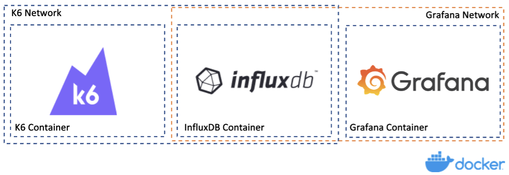
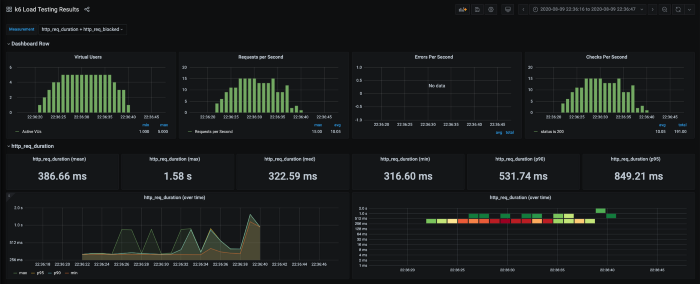

## PERFORMANCE TESTING
[K6]: https://k6.io/docs/
[InfluxDB]: https://docs.influxdata.com/influxdb/v2.6/get-started/
[Grafana]: https://grafana.com/docs/grafana/latest/introduction/

### Technology used in the project:
* [K6] - is an open-source load testing tool
* [InfluxDB] - is a high-speed read and write database
* [Grafana] - is the open source analytics & monitoring

-------------------------------------------------

### How do they communicate with each other:

###### Breaking it Down containers


-------------------------------------------------

### How to check it out matrix from tests results:

###### Open a browser to http://localhost:3000/d/k6/k6-load-testing-results and I’ll have an view of my load test streaming across the page in real-time:


-------------------------------------------------

### How to run the tests:

##### Before tests

1. ###### Requires that InfluxDB and Grafana are already running in the background. Run the command below:
     `docker compose -f ./docker-compose.yml up -d influxdb grafana`
    > Ps.: The docker images will be downloaded, configured and executed as detached (-d) background processes.

##### Tests

2. ###### Run K6 tests:
    `docker compose -f ./docker-compose.yml run k6 run /scripts/tests/product_page/client_side_requestes.test.js`

-------------------------------------------------

### Project hierarchy structure:
```bash
.
├── environment_configs
│   ├── ****.json
│   └── ****.json
├── datapool
│   └── ****.csv
├── tests
│   ├── cache
│   │   └── ****.test.js
│   ├── database
│   │   └── ****.test.js
│   └── product_page
│       ├── ****.test.js
│       └── ****.test.js
├── utils
│   ├── ****.js
│   └── ****.js
├── docker-compose.yml
├── grafana-dashboard.yaml
├── grafana-datasource.yaml
├── index.js
├── package-lock.json
├── package.json
└── README.md
```